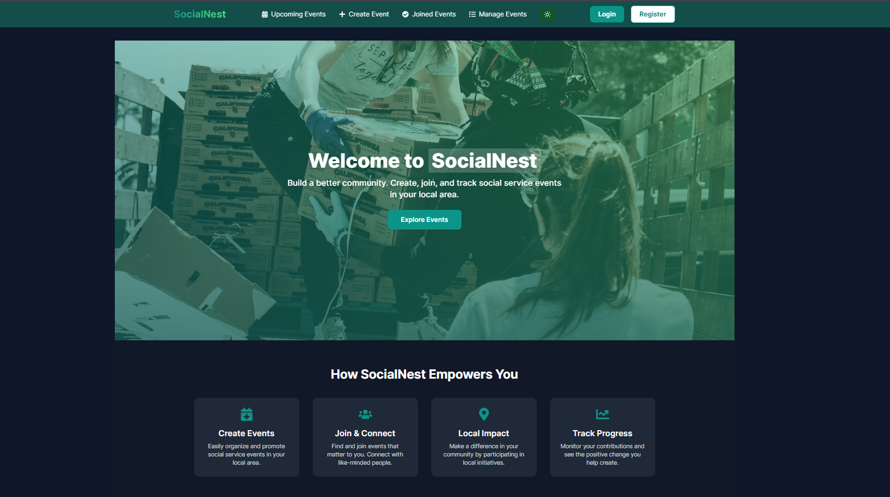

# SocialNest - Social Development Events Platform

A dynamic, community-driven event management platform that empowers users to create, participate in, and track social service events in their local communities. SocialNest brings together people passionate about making a positive impact through organized social initiatives.

## ✨ Key Features

### User Management
- 🔐 Secure Authentication with Email/Password
- 🔑 Google Sign-in Integration
- 👤 User Profile Management

### Event Management
- 📅 Create and Manage Social Service Events
- 🤝 Join and Track Community Events
- 🔍 Advanced Event Search and Filtering
- 📊 Real-time Event Updates

### User Experience
- 🌓 Dark/Light Theme Toggle
- 📱 Fully Responsive Design
- 🔒 Secure JWT Authentication
- 🎯 Intuitive User Interface

## 🛠️ Tech Stack

### Frontend Technologies
```
- ⚛️ React 18
- 🛣️ React Router for navigation
- 🎨 Tailwind CSS for styling
- 🔥 Firebase Authentication
- 🍞 React Hot Toast for notifications
- 📅 React Datepicker for date selection
- 💅 React Icons for UI elements
```

### Backend Technologies
```
- 📦 Node.js & Express.js
- 🗄️ MongoDB for database
- 🔒 JWT for secure authentication
- 🔄 CORS for cross-origin requests
- 🔐 Dotenv for environment variables
```

## 🚀 Getting Started

### Prerequisites
- Node.js (v14 or higher)
- npm or yarn
- MongoDB account
- Firebase project credentials

### Installation

1. Clone the repository
```bash
git clone https://github.com/your-username/socialnest.git
cd socialnest
```

2. Frontend Setup
```bash
# Navigate to client directory
cd client

# Install dependencies
npm install

# Create .env file and add your Firebase config
cp .env.example .env
```

3. Backend Setup
```bash
# Navigate to server directory
cd ../server

# Install dependencies
npm install

# Configure environment variables
cp .env.example .env
```

4. Start Development Servers
```bash
# Start frontend (in client directory)
npm run dev

# Start backend (in server directory)
npm run dev
```

### Screenshots

### Homepage


## 🤝 Contributing

Contributions are welcome! Please feel free to submit a Pull Request.

## 📝 License

This project is licensed under the MIT License - see the [LICENSE](LICENSE) file for details.

## 🌐 Live Demo

Visit [SocialNest](https://sociial-nest.netlify.app/) to see the platform in action!
