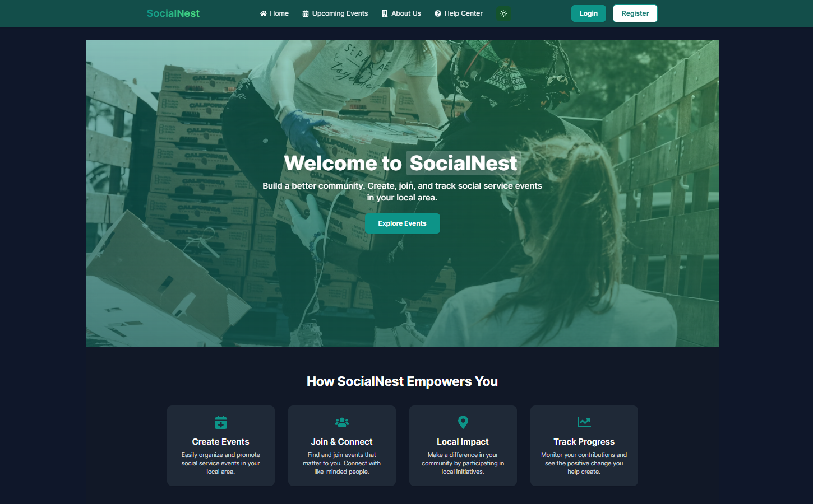

# SocialNest - Social Development Events Platform

A dynamic, community-driven event management platform that empowers users to create, participate in, and track social service events in their local communities. SocialNest brings together people passionate about making a positive impact through organized social initiatives.

## ✨ Key Features

### User Management
- 🔐 Secure Authentication with Email/Password
- 🔑 Google Sign-in Integration
- 👤 User Profile Management
- 📊 Personalized User Dashboard

### Event Management
- 📅 Create and Manage Social Service Events
- 🤝 Join and Track Community Events
- 🔍 Advanced Event Search and Filtering
- 📈 Real-time Event Updates
- 🎯 Centralized Dashboard for Event Management
- ✅ Joined Events Tracking
- ⚙️ Event Organizer Dashboard

### Community Engagement
- 🌍 **SocialNest Feed** - Community social feed for sharing volunteer stories
- ✍️ Create Posts with Text and Images
- ❤️ Like and Comment on Posts
- 🏷️ Category-based Post Filtering
- 📊 Trending Posts Discovery
- 💬 Real-time Community Interactions

### AI-Powered Assistance
- 🤖 **AI Chatbot** - Intelligent assistant for platform guidance
- 💡 Event Discovery Recommendations
- ❓ Instant Help and FAQs
- 🎯 Personalized User Support

### User Experience
- 🌓 Dark/Light Theme Toggle
- 📱 Fully Responsive Design (Mobile, Tablet, Desktop)
- 🔒 Secure JWT Authentication
- 🎯 Intuitive User Interface
- 🔔 Toast Notifications for User Feedback
- ⚡ Fast Loading with Optimized Performance

## 🛠️ Tech Stack

### Frontend Technologies
```
- ⚛️ React 19
- 🛣️ React Router v6 for navigation
- 🎨 Tailwind CSS with custom theme
- 🔥 Firebase Authentication (Email/Password & Google)
- 🍞 React Hot Toast for notifications
- 📅 React Datepicker for date selection
- 💅 React Icons for UI elements
- 🎭 Headless UI for accessible components
- 🪖 React Helmet for SEO
- 📝 React Hook Form for form handling
- ⚡ Vite for blazing fast development
```

### Backend Technologies
```
- 📦 Node.js & Express.js
- 🗄️ MongoDB Atlas for cloud database
- 🔒 JWT for secure authentication
- 🔄 CORS for cross-origin requests
- 🔐 Dotenv for environment variables
- 🚀 Deployed on Vercel (Serverless Functions)
```

### Collections & Data Models
```
- 👥 Users Collection (profiles, preferences)
- 📅 Events Collection (social service events)
- 🤝 Joined Events Collection (participation tracking)
- 📝 Posts Collection (community feed content)
- 💬 Comments & Likes (embedded in posts)
```

## 🚀 Getting Started

### Prerequisites
- Node.js (v14 or higher)
- npm or yarn
- MongoDB Atlas account
- Firebase project with Authentication enabled
- Firebase credentials (for Google Sign-in)

### Installation

1. Clone the repository
```bash
git clone https://github.com/your-username/socialnest.git
cd socialnest
```

2. Frontend Setup
```bash
# Navigate to client directory
cd client

# Install dependencies
npm install

# Create .env file and add your Firebase config
cp .env.example .env
```

3. Backend Setup
```bash
# Navigate to server directory
cd ../server

# Install dependencies
npm install

# Configure environment variables
cp .env.example .env
```

4. Configure Environment Variables

**Frontend (.env)**
```env
VITE_apiKey=your_firebase_api_key
VITE_authDomain=your_firebase_auth_domain
VITE_projectId=your_firebase_project_id
VITE_storageBucket=your_firebase_storage_bucket
VITE_messagingSenderId=your_firebase_messaging_sender_id
VITE_appId=your_firebase_app_id
```

**Backend (.env)**
```env
DB_USER=your_mongodb_username
DB_PASS=your_mongodb_password
PORT=5000
```

5. Start Development Servers
```bash
# Start frontend (in client directory)
npm run dev
# Frontend runs on http://localhost:5173

# Start backend (in server directory)
npm run dev
# Backend runs on http://localhost:5000
```

## 📸 Platform Features

### 🏠 Homepage
- Hero banner with call-to-action
- Feature showcase section
- Community gallery
- User testimonials
- Social feed preview
- Newsletter subscription

### 📊 User Dashboard
- Personal statistics (events joined, created, posts)
- Quick action cards (Create Event, View Joined/Managed Events)
- Engagement metrics (likes, comments)
- Profile information display
- Dark mode support

### 🌍 SocialNest Feed (Community Page)
- Create posts with text and images
- Category-based filtering
- Sort by Most Recent or Trending
- Like and comment functionality
- Real-time post updates
- Responsive card layout

### 📅 Event Management
- Create new events with detailed information
- Upload event thumbnails
- Set event date, time, and location
- Manage participant registrations
- Edit and delete your events
- Join community events

### 🤖 AI Chatbot
- Interactive chat interface
- Event discovery assistance
- Platform guidance and help
- Quick question responses
- Contextual recommendations

### 👤 User Profile
- Update display name and photo
- View participation history
- Manage account settings
- Theme preferences

### Screenshots

### Homepage


## 🤝 Contributing

Contributions are welcome! Please follow these steps:

1. Fork the repository
2. Create your feature branch (`git checkout -b feature/AmazingFeature`)
3. Commit your changes (`git commit -m 'Add some AmazingFeature'`)
4. Push to the branch (`git push origin feature/AmazingFeature`)
5. Open a Pull Request

## 📝 License

This project is licensed under the MIT License - see the [LICENSE](LICENSE) file for details.

## 🌐 Live Demo

Visit [SocialNest](https://sociial-nest.netlify.app/) to see the platform in action!

## 📧 Contact

For questions or support, please reach out through the platform's Help Center or create an issue in this repository.

---

**Made with ❤️ for communities making a difference** 🌍
